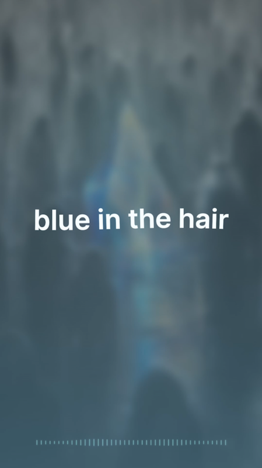
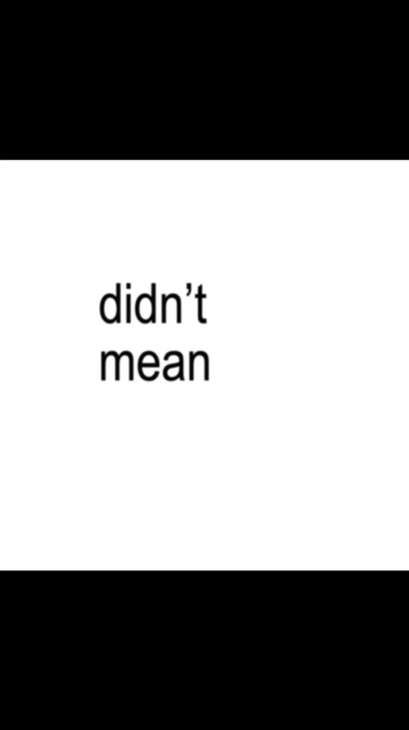

# LRC Visualizer

**简体中文** · [English](./README.en.md)

在浏览器中完成歌词打轴、视觉设计与视频导出。所有素材均在本地处理。

[在线使用](https://y1ch3nq.github.io/lrc-visualizer/)

## 视频示例

| 柔性单句歌词 | TikTok 黑白逐词 |
| --- | --- |
| [](docs/media/single-line-wave.mp4?raw=1) | [](docs/media/tiktok-word-reveal.mp4?raw=1) |
| 点击封面播放 | 点击封面播放 |

## 使用方法

1. 导入音频与 LRC，或粘贴纯文本进入打轴器。
2. 校正逐句、句尾或逐词时间。
3. 选择画面模式、画幅、字体、颜色与背景。
4. 预览并导出完整视频或指定片段。

## 画面模式

| 模式 | 特点 |
| --- | --- |
| 普通滚动歌词 | 多行滚动与逐行高亮 |
| 汽水音乐卡片 | 聚焦当前歌词的卡片式画面 |
| 单句水波歌词 | 整行柔性波动，可选入场变速 |
| TikTok 黑白逐词 | 三行分页与逐词显现 |

支持 `16:9`、`9:16`、`1:1`，以及自定义字体、图片背景、本地取色和鼓点律动条。

## 导出

普通背景优先导出 MP4；透明背景导出 VP9 Alpha WebM；TikTok 模式还可导出逐词 PNG 序列 ZIP。透明导出建议使用最新版 Chromium/Chrome。

## 本地运行

```bash
npm install
npm run dev
```

macOS 也可以直接运行 `start-dev.command`。生产构建使用 `npm run build`。
